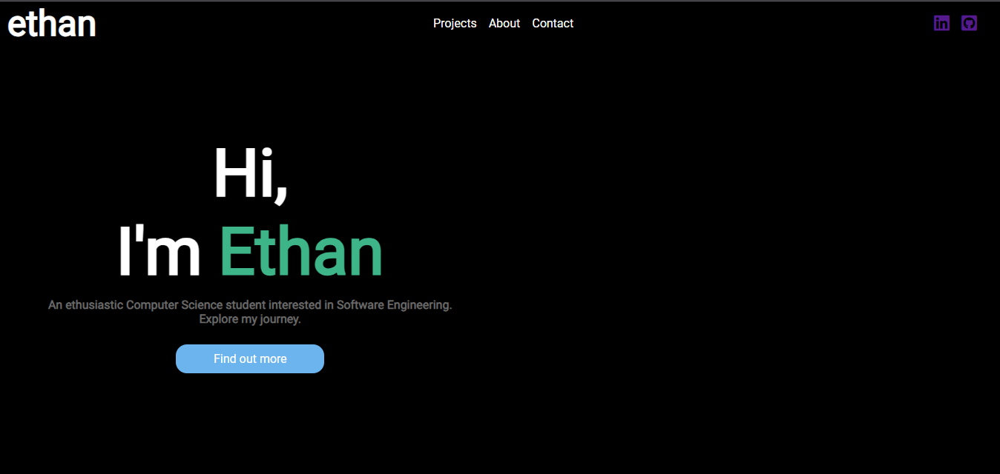

# Web Programming Repo

 ## This repository contains a series of small projects that will display the progression of my knowledge.

1) Personal Website - The beginning of an e-portfolio designed to follow my progress

2) Weekly lab exercises - used to become familiar with new concepts

